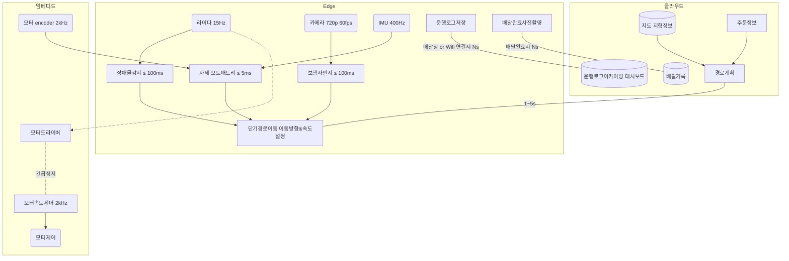
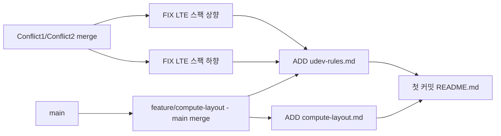
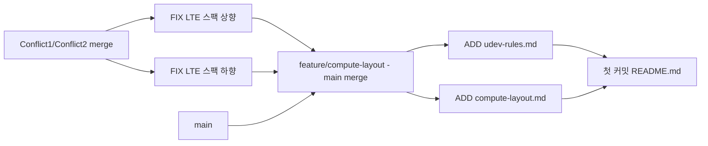

# 1. 배달 로봇의 연산 분담과 실시간성 설계
## 0. 전제조건(가정포함)
|No.|센서|주기|1회데이터(가정)|데이터량(/s)|비고|
|---|----|----|----|----|---|
|1|엔코더|2kHz|4(Byte) X 2(륜) = 8(Byte) |128kbps|
|2|2D라이다|15Hz|360점 X (거리 4byte + 세기 4byte) = 2880byte|345.6kbps|
|3|RGB카메라|60fps-720p|1280 X 720 X 3Byte = 2764800 byte |1,327,104 Gbps |
|4|IMU|400Hz|(가속도3축+각속도3축) X 4byte + 타임스템프 8byte = 32byte|102.4kbps|
|5|LTE모듈|||100Mbps|RTT 15ms
||||||


> 로봇의 주행 속도는 보도 주행 규정에 맞춰 $v=1.5m/s,\>\>\> a=2m/s^{2}$로 가정합니다. 이 값으로 제동거리는 $v^2/2a=0.56m$이고 $100ms$ 반응 지연마다 $0.15m$씩 진행합니다.


## 1. 연산 분담 배치표

|No.|작업            |위치|지연 예산|데이터량|근거|
|---|---------------|----|---------|--------|----|
| 1 |모터 속도 제어 |임베디드| $\leq$ 1ms | 128kbps |LTE의 RTT가 예산의 15배이상 - 클라우드X  Edge AI도 1ms를 보장 X |
| 2 |장애물 감지|Edge AI| $\leq$ 100ms |345kbps|LTE 클라우드 왕복지연과 끊김 위험으로 클라우드 X  지도, 경로와 결합 = Edge  단 비상정지는 임베디드로 작동|
| 3 |보행자 인식|Edge AI|$\leq$ 100ms |1.33Gbps|원시데이터 1.33Gbps로 대역폭 100Mbps를 14배 초과 - 클라우드 X  온보드GPU 경량 검출 모델로 40ms 이내 결과 검출하여 판단 계층으로 넘겨야|
| 4 |지도 기반 경로 계획|클라우드|1~5s|요청(주소등 수 백byte), 응답 waypoint 수 kbyte|지도 DB 대용량, 로봇의 현재위치를 제외한 경로를 위한 모든 데이터는 클라우드에 이미 존재|
| 5 |배달 완료 사진 업로드|클라우드|수 초|JPEG이미지 1개 2~3Mbyte, 1배달 1건 발생|아카이빙, 고객 알림, 분쟁증빙 - 서버기능 1~2s 내 전송|
| 6 |운행 로그 집계|클라우드|수분~수시간|수십kbyte/s 압축시 수십mbyte/day|로컬압축저장 후 유휴시에 Wi-Fi 업로드  |

## 2. 카메라 원시 영상 전송량, LTE 대비 판단
RGB채널 720p 60fps 카메라  
>1 Frame 당 = 1280 X 720 X 3 byte X 8 bit = 22,118,400 bit  
초당 = 22,118,400 bit X 60 frame/sec = 1,327,104,000 bit = 약 1.33 Gbps  
하루 11.47 Tbyte

LTE 업링크 100Mbps(Cat.4) => 13배 이상 부족
LTE 음영지역 진입시 장애물 감지에 대응 할 수 없기에 안전을 위해 로봇을 스스로 세울 수 밖에 없고, 이런경우 음영지역에서 스스로 벗어나지 못함.

대역폭, 음영지역 대응, 통신요금 모두 부적합


## 3. 인지 판단 제어 계층 매핑과 주기표

|계층|작업|갱신주기|실행 위치|입력->출력|
|---|---|---|---|---|
|인지|엔코더 읽기|2kHz|임베디드|펄스카운트 -> 이동거리|
|제어|모터속도제어|2kHZ|임베디드|목표속도 -> PID제어|
|인지|장애물감지|15Hz|Edge&임베디드|포인트거리세기 -> 장애물방향거리(Edge) 비상정지신호(임베디드)|
|인지|보행자인식|60Hz|Edge|1프레임 이미지 -> 보행자거리|
|인지|오도메트리|400Hz|Edge|축별가속도 -> 이동방향거리|
|판단|지도기반경로계획|0.05Hz|클라우드|현재위치,목적지위치 -> 경로 waypoint|
|판단|장애물우회|15Hz|Edge|장애물&보행자위치->경로 waypoint 수정|

<br></br>
### 멀티레이트



## 4. Hard Firm Soft 실시간 분류
|작업| 등급| 마감| 마감을 놓치면| 근거|
|---|---|---|---|---|
|모터속도제어|Hard|1 ms|경로이탈, 충돌|긴급제동등을 놓치면 사고|
|장애물감지|Hard|100 ms|충돌발생|충돌확률증가|
|보행자인식|Firm|100 ms|늦게 인식되는 경우 의미없는 데이터로 폐기됨. 충돌은 라이다로 피할 수 있음|놓쳐도 실패는 아님|
|지도기반경로계획|Soft|1~5 s|로봇의 대기가 필요한 경우 발생|파괴적인 문제가 생기지 않음|
|운행로그집계|Soft|시간단위|모니터링에 지연발생|배달서비스 자체와는 크게 연관 없음|
|배달완료사진전송|Soft|1 m|고객에게 알림이 늦게 감|음식을 배달하는 경우라면 빠를수록 좋지만 1분 안쪽이라면 충분하다.|

## 5. 주기 지연 지터 구분 (한문장씩)
- __주기__: 작업 반복이 이뤄지는 시간 간격으로 센서갱신주기와 하드웨어 스팩, 등급등을 고려하여 지연이 발생하지 않을 범위내에서 정함
- __지연__: 원인부터 결과가 도출될때까지 걸리는 소요시간
- __지터__: 지연오차. 오차가 크고 자주 발생하면 시스템 운영이 불가능하다.

# 2. 원격 접속(SSH)과 센서 장치 경로 고정

## 1. 무비밀번호 원격접속
```bash
➜ ssh pa28@localhost
Welcome to Ubuntu 22.04.5 LTS (GNU/Linux 6.8.0-138-generic x86_64)

 * Documentation:  https://help.ubuntu.com
 * Management:     https://landscape.canonical.com
 * Support:        https://ubuntu.com/pro

Applications를 위한 확장된 보안 유지보수 비활성화됨.

0개의 업데이트가 즉시 적용 가능합니다.

152 추가 보안 업데이트는 ESM Apps에 적용될 수 있습니다. 
ESM Apps 서비스 at https://ubuntu.com/esm 활성화에 대해 자세히 알아보십시오.

Last login: Tue Aug 25 09:52:11 2026 from 127.0.0.1

pa28 in 🌐 pa28-Legion-Pro-5-16IAX10 in ~ 
➜ who
pa28     tty2         2026-08-25 08:28 (tty2)
pa28     pts/3        2026-08-25 17:10 (127.0.0.1)

pa28 in 🌐 pa28-Legion-Pro-5-16IAX10 in ~ 
➜ echo $SSH_CONNECTION
127.0.0.1 43014 127.0.0.1 22
```

## 2. 개인키 공개키
- 서버등록: 공개키
- 안전한 이유: 공개키만으로는 개인키를 알아 낼 수 없으며 개인키는 나만 가지고 있기 때문.

## 3. 원격단일명령 & scp 전송
- 원격단일명령
```bash
➜ ssh pa28@localhost 'uname -a'
Linux pa28-Legion-Pro-5-16IAX10 6.8.0-138-generic #138~22.04.1-Ubuntu SMP PREEMPT_DYNAMIC Fri Aug  7 13:43:15 UTC  x86_64 x86_64 x86_64 GNU/Linux
```
- scp
```bash
# 현재 디렉터리의 하부구조확인
➜ tree
.
├── hi.txt
└── test

1 directory, 1 file

# scp로 파일 전송
➜ scp hi.txt pa28@localhost:/home/pa28/test/test/
hi.txt                                                                 100%    0     0.0KB/s   00:00    

# scp로 파일 전송 되었는지 확인
➜ tree
.
├── hi.txt
└── test
    └── hi.txt

1 directory, 2 files

```

## 4. Rules 구분 속성
```bash
# loop device 구분을 위해 사용한 속성
ATTR{loop/backing_file}=="*lidar.img"
ATTR{loop/backing_file}=="*imu.img",
```
```bash
# 해당 속성 확인 방법
➜ cat /sys/devices/virtual/block/loop21/loop/backing_file && cat /sys/devices/virtual/block/loop22/loop/backing_file                                            
/home/pa28/fake_sensors/lidar.img
/home/pa28/fake_sensors/imu.img

```


## 5. Rule 규칙 키 설명
```bash
#MODE는 udev 접근권한으로 0666은 모든 사용자가 접근 가능하다.
#SYMLINK는 시리얼에 접근하는 파일(링크)명이며 += 한 이유는 기존 /dev/loop* 이 있고 추가로 고정할 위치를 정하는 것이기 때문이다.
#==는 조건이 맞는지 확인하는 것

# 라이다
KERNEL=="loop*", SUBSYSTEM=="block", ATTR{loop/backing_file}=="*lidar.img", SYMLINK+="robot_lidar", MODE="0666"

# IMU
KERNEL=="loop*", SUBSYSTEM=="block", ATTR{loop/backing_file}=="*imu.img", SYMLINK+="robot_imu", MODE="0666"

```

| 키워드 | 구분 | 의미 | 예시 |
| :--- | :--- | :--- | :--- |
| **`SUBSYSTEM`** | 매칭 조건 | 장치가 속한 커널 하위 시스템을 지정 | `SUBSYSTEM=="usb"` |
| **`KERNEL`** | 매칭 조건 | 커널이 장치에 부여한 기본 이름을 지정 | `KERNEL=="ttyUSB*"` |
| **`ATTR{...}`** | 매칭 조건 | sysfs에 등록된 장치의 고유 속성을 지정 | `ATTR{idVendor}=="0403"` |
| **`SYMLINK+=`** | 할당 작업 | 기본 장치 파일 외에 추가로 생성할 심볼릭 링크 이름을 지정 | `SYMLINK+="my_device"` |
| **`MODE`** | 할당 작업 | 생성될 장치 파일의 권한(Permission)을 설정 | `MODE="0666"` |
| **`GROUP`** | 할당 작업 | 생성될 장치 파일의 소유 그룹을 지정 | `GROUP="dialout"` |

| 연산자 | 구분 | 의미 및 작동 방식 | 사용 예시 |
| :---: | :---: | :--- | :--- |
| **`==`** | **매칭 (비교)** | 왼쪽 항목의 값이 오른쪽 값과 **일치하는지 검사**합니다. | `SUBSYSTEM=="tty"` |
| **`=`** | **할당 (대입)** | 해당 항목의 값을 오른쪽 값으로 **새롭게 설정하거나 덮어씁니다.** | `MODE="0660"` |
| **`+=`** | **추가 (누적)** | 기존에 설정된 값들 뒤에 오른쪽 값을 **목록으로 추가**합니다. | `SYMLINK+="my_usb"` |

## 6. 순서를 바꿔 재연결

```bash
# lidar, imu 순으로 연결
➜ sudo losetup -f --show lidar.img 
/dev/loop9

➜ sudo losetup -f --show imu.img   
/dev/loop24

# lidar -> loop9, imu -> loop24 에 할당됨
➜ ls -l /dev/robot_*
lrwxrwxrwx 1 root root 6  9월  4 11:21 /dev/robot_imu -> loop24
lrwxrwxrwx 1 root root 5  9월  4 11:21 /dev/robot_lidar -> loop9

➜ losetup -a | grep fake      
/dev/loop9: [66309]:17447727 (/home/pa28/fake_sensors/lidar.img)
/dev/loop24: [66309]:17447729 (/home/pa28/fake_sensors/imu.img)


#모두 detach
❯ sudo losetup -d /dev/robot_*

#detach 확인
➜ ls -l /dev/robot_*         
zsh: no matches found: /dev/robot_*

# imu, lidar 순으로 연결
❯ sudo losetup -f --show imu.img  
/dev/loop9

➜ sudo losetup -f --show lidar.img
/dev/loop24

# imu->loop9, lidar->loop24에 할당되었고, 순서가 바뀌어도 robot_imu, robot_lidar도 정상적으로 연결됨을 확인
➜ ls -l /dev/robot_*         
lrwxrwxrwx 1 root root 5  9월  4 11:24 /dev/robot_imu -> loop9
lrwxrwxrwx 1 root root 6  9월  4 11:24 /dev/robot_lidar -> loop24

➜ losetup -a | grep fake          
/dev/loop9: [66309]:17447729 (/home/pa28/fake_sensors/imu.img)
/dev/loop24: [66309]:17447727 (/home/pa28/fake_sensors/lidar.img)
```

## 7. 실제 USB 센서용 규칙 초안과 구분 근거

| 장치 | idVendor | idproduct |
| :---: | :---: | :---: |
|라이다|10c4|ea60|
|IMU|10c4|ea70|

```bash
# 라이다
SUBSYSTEM=="tty", KERNEL=="ttyUSB*", ATTRS{idVendor}=="10c4", ATTRS{idProduct}=="ea60", SYMLINK+="Robot_lidar"

# IMU
SUBSYSTEM=="tty", KERNEL=="ttyUSB*", ATTRS{idVendor}=="10c4", ATTRS{idProduct}=="ea70", SYMLINK+="Robot_imu"
```
- 지금처럼 같은 제조사에서 제작하여 idVendor가 같은경우 idProduct도 함께 추가하여 구분한다.

# 3. 팀 저장소 협업 - 브랜치-충돌해결-PR리뷰
## 1. 저장소 및 PR URL
- 저장소:
https://github.com/pizzaafterhangover/git_test

- PU:
https://github.com/pizzaafterhangover/git_test/pull/1

## 2. PR리뷰 코멘트와 반영 커밋
- PU:
https://github.com/pizzaafterhangover/git_test/pull/1

## 3. 충돌이 난 파일과 줄
- conflict1 브랜치와 conflict2 브랜치의 README.md line:8 의 "LTE" 스펙 중 실측 전송폭을 서로 다르게 함.
- conflict1을 원본으로 하여 conflict2를 merge 하여 충돌발생
- 충돌난 상태 그대로 커밋 & 푸시
- 충돌상태 커밋 URL: https://github.com/pizzaafterhangover/git_test/commit/3c6b4cd31bac3dd7730aa66e17e4305155b5fe02
- 충돌상태 해결(conflict1 내용 채택) 커밋 URL: https://github.com/pizzaafterhangover/git_test/commit/e95b88fa064b3c7c35a4ee7d6a4f0d06cfc75adc

- <<<<<<< HEAD
     - merge 원본이 되는 곳의 내용
- =======
    - 위와 아래 구역을 구분하는 구분자
- \>>>>>>> conflict2
    - merge 가져오려고 하는 곳의 내용
- 
```
README.md line 8
<<<<<<< HEAD
|5|LTE모듈|||이론상 50Mbps 실측 5~30Mbps|RTT 30~100ms
=======
|5|LTE모듈|||이론상 50Mbps 실측 5~10Mbps|RTT 30~100ms
>>>>>>> conflict2
```

## 4. merge 방식 이력 그래프 / rebase방식 이력 그래프
### main과  feature/compute-layout 머지 -> 새로운 커밋이 생성되어 3점 머지가 발생

### 바로 위 상황인 main에 conflict1 rebase -> feature/udev-ruels에서 분기한 conflict를 분기직후부터 최근의 main 이후로 옮김 -> main에서 분기된 과거에서 최근 분기로 이동


## 5. merge와 rebase 를 각각 언제 쓰면 좋을지?
- merge: 상대적으로 안전하고 기존 커밋이 보전됨 -> 공유된 메인 브랜치에 기능을 최종 반영할 때
- rebase: 행태가 단순해짐, push하면 과거의 커밋 기록이 사라지는 단점 -> 커밋을 너무 지저분한게 작성한 경우 정리를 위해 단 팀원이 사용하고 있는 브랜치는 rebase하면 안되며 개인적으로 내부 브랜치를 정리하기에 좋다.