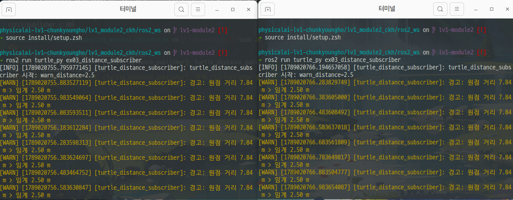
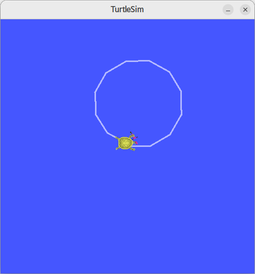

# 1. C++ 빌드체계 세우기
## 1. 수동 2단계 빌드 명령
```bash
physicalai-lv1-chunkyoungho/lv1_module2_천경호/cpp_basics on  모듈2-시작 [!?] via △ v3.22.1 
➜ g++ -Wall -std=c++17 stop_distance.cpp               

physicalai-lv1-chunkyoungho/lv1_module2_천경호/cpp_basics on  모듈2-시작 [!?] via △ v3.22.1 
➜ ls -al
합계 68
drwxrwxr-x 4 pa28 pa28  4096  9월  4 14:41 .
drwxrwxr-x 6 pa28 pa28  4096  9월  4 09:07 ..
-rw-rw-r-- 1 pa28 pa28   446  9월  4 14:23 CMakeLists.txt
-rwxrwxr-x 1 pa28 pa28 29496  9월  4 14:41 a.out
drwxrwxr-x 3 pa28 pa28  4096  9월  4 14:38 build
-rw-rw-r-- 1 pa28 pa28   101  9월  4 13:58 main.cpp
-rw-rw-r-- 1 pa28 pa28   106  9월  4 14:28 motor.cpp
-rw-rw-r-- 1 pa28 pa28   150  9월  4 13:52 motor.hpp
drwxrwxr-x 2 pa28 pa28  4096  8월 25 14:10 sensors
-rw-rw-r-- 1 pa28 pa28  1536  9월  4 13:46 stop_distance.cpp

physicalai-lv1-chunkyoungho/lv1_module2_천경호/cpp_basics on  모듈2-시작 [!?] via △ v3.22.1 
➜ ./a.out 10.2 1.1
velocity: 10.2 m/s   decle: 1.1 m/s^2     stop distance: 47.2909 m
```

## 2. 링크에러
```bash
physicalai-lv1-chunkyoungho/lv1_module2_천경호/cpp_basics on  모듈2-시작 [!?] via △ v3.22.1 
➜ g++ -c main.cpp motor.cpp

physicalai-lv1-chunkyoungho/lv1_module2_천경호/cpp_basics on  모듈2-시작 [!?] via △ v3.22.1 
➜ g++ robot -o main.o
/usr/bin/ld: cannot find robot: 그런 파일이나 디렉터리가 없습니다
collect2: error: ld returned 1 exit status
```

## 3. CMake 빌드 출력
```bash
lv1_module2_천경호/cpp_basics/build on  모듈2-시작 [!?] 
➜ cmake ..
-- The CXX compiler identification is GNU 11.4.0
-- Detecting CXX compiler ABI info
-- Detecting CXX compiler ABI info - done
-- Check for working CXX compiler: /usr/bin/c++ - skipped
-- Detecting CXX compile features
-- Detecting CXX compile features - done
-- Configuring done
-- Generating done
-- Build files have been written to: /home/pa28/kant_gits/physicalai-lv1-chunkyoungho/lv1_module2_천경호/cpp_basics/build
```

## 4. 증분빌드
``` bash
➜ ls -al ./CMakeFiles/robot.dir 
합계 68
drwxrwxr-x 2 pa28 pa28 4096  9월  4 14:28 .
drwxrwxr-x 5 pa28 pa28 4096  9월  4 14:28 ..
-rw-rw-r-- 1 pa28 pa28  768  9월  4 14:23 DependInfo.cmake
-rw-rw-r-- 1 pa28 pa28 6438  9월  4 14:23 build.make
-rw-rw-r-- 1 pa28 pa28  348  9월  4 14:23 cmake_clean.cmake
-rw-rw-r-- 1 pa28 pa28  594  9월  4 14:28 compiler_depend.internal
-rw-rw-r-- 1 pa28 pa28  363  9월  4 14:28 compiler_depend.make
-rw-rw-r-- 1 pa28 pa28  112  9월  4 14:23 compiler_depend.ts
-rw-rw-r-- 1 pa28 pa28   89  9월  4 14:23 depend.make
-rw-rw-r-- 1 pa28 pa28  270  9월  4 14:23 flags.make
-rw-rw-r-- 1 pa28 pa28   88  9월  4 14:23 link.txt
-rw-rw-r-- 1 pa28 pa28 1640  9월  4 14:23 main.cpp.o
-rw-rw-r-- 1 pa28 pa28  252  9월  4 14:23 main.cpp.o.d
-rw-rw-r-- 1 pa28 pa28 1488  9월  4 14:28 motor.cpp.o
-rw-rw-r-- 1 pa28 pa28  254  9월  4 14:28 motor.cpp.o.d
-rw-rw-r-- 1 pa28 pa28   64  9월  4 14:23 progress.make

lv1_module2_천경호/cpp_basics/build on  모듈2-시작 [!?] via △ v3.22.1 
➜ ls -al                       
합계 56
drwxrwxr-x 3 pa28 pa28  4096  9월  4 14:28 .
drwxrwxr-x 4 pa28 pa28  4096  9월  4 14:22 ..
-rw-rw-r-- 1 pa28 pa28 12491  9월  4 14:22 CMakeCache.txt
drwxrwxr-x 5 pa28 pa28  4096  9월  4 14:28 CMakeFiles
-rw-rw-r-- 1 pa28 pa28  6042  9월  4 14:23 Makefile
-rw-rw-r-- 1 pa28 pa28  1738  9월  4 14:23 cmake_install.cmake
-rwxrwxr-x 1 pa28 pa28 16048  9월  4 14:28 robot
```

>.build/CMakeFiles/robot.dir 의 motor.cpp.o와 motor.cpp.o.d, .build/robot 세 파일만 14:28분에 변경된 것을 알 수 있다.
>-> 수정된 파일만 재컴파일이 되며, 증분빌드는 마지막 빌드에서 새롭게 수정된 파일만 컴파일하여 빌드한다는 것을 알 수 있다.

# 2. 현대 C++로 센서 계층 구현
## 1. 다형성 루프 출력
```bash
lv1_module2_천경호/cpp_basics/sensors on  모듈2-시작 [?⇡] 
➜ g++ -Wall -std=c++17 -o a.out sensor.cpp

lv1_module2_천경호/cpp_basics/sensors on  모듈2-시작 [?⇡] 
➜ ./a.out                                 
0.1 0.1 0.1 
0.2 0.2 0.2 
```
## 2. 스택 객체와 힙 객체의 소멸 시점
```bash
lv1_module2_천경호/cpp_basics/sensors on  모듈2-시작 [!?⇡] 
➜ ./a.out                                 
동적할당 및 지역변수선언
0.1 0.1 0.1 
0.2 0.2 0.2 
동적할당 종료
IMU 소멸
Lidar 소멸
프로그램 종료
IMU 소멸
```
> 동적할당 객체는 vector.pop_back() 으로 vector 컨테이너에서 동적할당된 객체들을 제외하자 바로 소멸됨.
> 지역변수로 생성된 객체는 종료될 때 소멸됨
> 지역 변수는 stack에서 프로그램과 함께 시작되며 예약되어 사용되지만, 동적할당은 용량이 얼마나 큰지 모르기 때문에 Heap 영역에서 동적으로 할당해준다. 이전 malloc / free 를 사용했을 때는 동적할당과 할당된 메모리를 객체가 사용되지 않을때 free 해줘야 하는 번거로움과 그것을 까먹는 경우 메모리 누수가 발생하였다. 하지만 지금은 unique_ptr, shared_ptr 덕분에 동적 할당이 자동으로 소멸된다.

## 3. 가상 소멸자를 뺏을 때의 차이
```bash
➜ ./a.out                                 
동적할당 및 지역변수선언
0.1 0.1 0.1 
0.2 0.2 0.2 
동적할당 종료
프로그램 종료
IMU 소멸
```
> 동적할당된 객체가 자동으로 소멸되지 않는다.

## 4. count_if 결과

```bash
cpp_basics/sensors/build on  모듈2-시작 [!?⇡] via △ v3.22.1 
➜ ./sensor.out
2-2 동적할당 및 지역변수선언
2-1 0.1 0.1 0.1 
2-1 0.2 0.2 0.2 
2-2 동적할당 종료
IMU 소멸
Lidar 소멸
2-4 lidar 0.35 이내 점: 3 개
2-2 프로그램 종료
Lidar 소멸
IMU 소멸
```

## 5. 누수 검출 결과
```bash
lv1_module2_천경호/cpp_basics/sensors on  모듈2-시작 [!?⇡] via △ v3.22.1 
➜ g++ -g -fsanitize=address memoryleak.cpp -o mem.out

lv1_module2_천경호/cpp_basics/sensors on  모듈2-시작 [!?⇡] via △ v3.22.1 
➜ ./mem.out 

=================================================================
==69358==ERROR: LeakSanitizer: detected memory leaks

Direct leak of 16000000 byte(s) in 1000000 object(s) allocated from:
    #0 0x7efea7cb61e7 in operator new(unsigned long) ../../../../src/libsanitizer/asan/asan_new_delete.cpp:99
    #1 0x57c63ae7d1a7 in main /home/pa28/kant_gits/physicalai-lv1-chunkyoungho/lv1_module2_천경호/cpp_basics/sensors/memoryleak.cpp:13
    #2 0x7efea7429d8f in __libc_start_call_main ../sysdeps/nptl/libc_start_call_main.h:58

SUMMARY: AddressSanitizer: 16000000 byte(s) leaked in 1000000 allocation(s).

lv1_module2_천경호/cpp_basics/sensors on  모듈2-시작 [!?⇡] via △ v3.22.1 
❯ g++ -g -fsanitize=address memoryleak.cpp -o mem.out

lv1_module2_천경호/cpp_basics/sensors on  모듈2-시작 [!?⇡] via △ v3.22.1 
➜ ./mem.out   
```

# 3. rclpy 노드 작성
## 1. /turtle1/pose 필드 구성: ___
```bash
x: 5.544444561004639
y: 5.544444561004639
theta: 0.0
linear_velocity: 0.0
angular_velocity: 0.0
---
```
## 2. ros2 topic hz /turtle_distance 출력: 평균 ___ Hz
```bash
➜ ros2 topic hz /turtle_distance
average rate: 9.998
	min: 0.100s max: 0.100s std dev: 0.00013s window: 11
average rate: 9.999
	min: 0.100s max: 0.100s std dev: 0.00012s window: 22
average rate: 10.000
	min: 0.100s max: 0.100s std dev: 0.00013s window: 33
average rate: 9.999
	min: 0.100s max: 0.100s std dev: 0.00014s window: 43
average rate: 10.000
	min: 0.100s max: 0.100s std dev: 0.00013s window: 54
average rate: 10.000
	min: 0.100s max: 0.100s std dev: 0.00013s window: 65

```

## 3. 구독자 경고 로그 (터미널 출력)
``` bash
[WARN] [1789020894.383331879] [turtle_distance_subscriber]: 경고: 원점 거리 7.92 m > 임계 2.50 m
[WARN] [1789020894.483497448] [turtle_distance_subscriber]: 경고: 원점 거리 7.92 m > 임계 2.50 m
[WARN] [1789020894.583530181] [turtle_distance_subscriber]: 경고: 원점 거리 7.92 m > 임계 2.50 m

```
## 4. 구독자 2개 동시 수신 확인 (양쪽 로그)


## 5. 정사각형 주행 캡처 (turtlesim 화면)


## 6. Ctrl+C 정상 종료 화면 (출력)
```bash
❯ ros2 run turtle_py ex03_distance_publisher    
[INFO] [1789022527.604611583] [turtle_distance_publisher]: turtle_distance_publisher 시작: publish_rate=10.0 Hz
^C[INFO] [1789022530.524337561] [turtle_distance_publisher]: Ctrl+C — 정상 종료합니다
Failed to publish log message to rosout: publisher's context is invalid, at ./src/rcl/publisher.c:389

```

# 4. rclcpp 노드 작성

## 1. colcon build 성공 출력
```bash
physicalai-lv1-chunkyoungho/lv1_module2_ckh/ros2_ws on  lv1-module2 [!?] 
➜ colcon build --symlink-install
[0.171s] WARNING:colcon.colcon_core.package_selection:Some selected packages are already built in one or more underlay workspaces:
	'turtle_interfaces' is in: /home/pa28/kant_gits/physicalai-lv1-chunkyoungho/lv1_module2_ckh/ros2_ws/install/turtle_interfaces
If a package in a merged underlay workspace is overridden and it installs headers, then all packages in the overlay must sort their include directories by workspace order. Failure to do so may result in build failures or undefined behavior at run time.
If the overridden package is used by another package in any underlay, then the overriding package in the overlay must be API and ABI compatible or undefined behavior at run time may occur.

If you understand the risks and want to override a package anyways, add the following to the command line:
	--allow-overriding turtle_interfaces

This may be promoted to an error in a future release of colcon-override-check.
Starting >>> turtle_interfaces
Starting >>> turtle_cpp
Finished <<< turtle_interfaces [0.27s]                                                           
Starting >>> turtle_py
Finished <<< turtle_py [0.71s]                                                    
Finished <<< turtle_cpp [5.03s]                     

Summary: 3 packages finished [5.17s]

```
## 2. rclpy 발행에서 rclcpp 구독으로 이어진 로그
```bash
➜ ros2 run turtle_cpp ex04_distance_publisher
➜ ros2 run turtle_py ex03_distance_publisher
[INFO] [1789024460.723546310] [turtle_distance_publisher]: turtle_distance_publisher 시작: publish_rate=10.0 Hz
^C[INFO] [1789024468.837786346] [turtle_distance_publisher]: Ctrl+C — 정상 종료합니다
```
```bash
➜ ros2 run turtle_cpp ex04_distance_subscriber
[INFO] [1789024301.683192094] [turtle_distance_subscriber]: turtle_distance_subscriber 시작: warn_distance=2.50
[WARN] [1789024301.742161617] [turtle_distance_subscriber]: 경고: 원점 거리 7.22 m > 임계 2.50 m
[WARN] [1789024301.842318265] [turtle_distance_subscriber]: 경고: 원점 거리 7.22 m > 임계 2.50 m
[WARN] [1789024301.942415329] [turtle_distance_subscriber]: 경고: 원점 거리 7.22 m > 임계 2.50 m
[WARN] [1789024302.042288731] [turtle_distance_subscriber]: 경고: 원점 거리 7.22 m > 임계 2.50 m
[WARN] [1789024302.142291248] [turtle_distance_subscriber]: 경고: 원점 거리 7.22 m > 임계 2.50 m
[WARN] [1789024302.242314558] [turtle_distance_subscriber]: 경고: 원점 거리 7.22 m > 임계 2.50 m
[WARN] [1789024302.342504485] [turtle_distance_subscriber]: 경고: 원점 거리 7.22 m > 임계 2.50 m
[WARN] [1789024302.442308116] [turtle_distance_subscriber]: 경고: 원점 거리 7.22 m > 임계 2.50 m
[WARN] [1789024302.542210157] [turtle_distance_subscriber]: 경고: 원점 거리 7.22 m > 임계 2.50 m
[WARN] [1789024302.642322919] [turtle_distance_subscriber]: 경고: 원점 거리 7.22 m > 임계 2.50 m
[WARN] [1789024302.742496026] [turtle_distance_subscriber]: 경고: 원점 거리 7.22 m > 임계 2.50 m
[WARN] [1789024302.842391847] [turtle_distance_subscriber]: 경고: 원점 거리 7.22 m > 임계 2.50 m
[WARN] [1789024302.942313557] [turtle_distance_subscriber]: 경고: 원점 거리 7.22 m > 임계 2.50 m
[WARN] [1789024303.042216178] [turtle_distance_subscriber]: 경고: 원점 거리 7.22 m > 임계 2.50 m
[WARN] [1789024303.142428455] [turtle_distance_subscriber]: 경고: 원점 거리 7.22 m > 임계 2.50 m
^C[INFO] [1789024303.221003517] [rclcpp]: signal_handler(SIGINT/SIGTERM)
[INFO] [1789024303.221234124] [turtle_distance_subscriber]: Ctrl+C — 정상 종료합니다
```

## 3. rclpy와 rclcpp 대응 관계표 — 노드 생성 / 타이머 / 콜백 / 종료 (4행)
| 단계 | Python (`rclpy`) | C++ (`rclcpp`) |
| :--- | :--- | :--- |
| **노드 생성** | `node = rclpy.create_node('my_node')` | `auto node = std::make_shared<rclcpp::Node>("my_node");` |
| **타이머** | `timer = node.create_timer(1.0, timer_callback)` | `auto timer = node->create_wall_timer(1s, timer_callback);` |
| **콜백** | `def timer_callback(): node.get_logger().info('hi')` | `auto timer_callback = [&]() { RCLCPP_INFO(node->get_logger(), "hi"); };` |
| **종료** | `rclpy.spin(node)` → `rclpy.shutdown()` | `rclcpp::spin(node);` → `rclcpp::shutdown();` |
